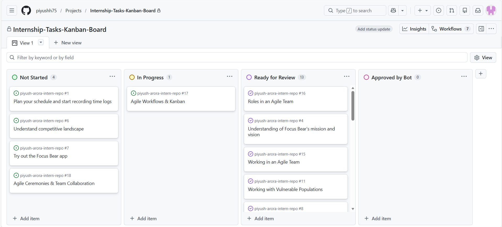

# 🔍 Research & Learn

## How a Kanban Board Works

A Kanban board is a visual tool used to manage work as it moves through various stages of a process. Its primary goal is to provide visibility. By seeing exactly where every task is, the team can identify bottlenecks (where work gets stuck) and ensure that no one is overwhelmed. It helps manage workflow by turning abstract tasks into physical cards that "flow" from left to right.

## What the Columns Represent

While every team is different, most Kanban boards use these standard stages:

**Backlog (To-Do):** The "waiting room" for all future tasks. These are ideas or requirements that haven't started yet.

**In Progress (Doing):** Tasks currently being worked on. This shows the team's active focus.

**Blocked:** A critical column for tasks that cannot move forward because of an external issue (e.g., waiting for a password or a bug fix from another team).

**Done:** The finish line. Tasks here are fully completed and verified.

## How Tasks Move

Tasks move through a "Pull System." Instead of a manager "pushing" work onto a developer, the developer "pulls" a new task from the Backlog into the In Progress column as soon as they have the capacity.

**Responsibility:** Every team member is responsible for moving their own cards. In Agile, the board is the "Source of Truth," so if you spend an hour on a task, that task must be moved to In Progress on the board.

## The Benefits of Limiting Work in Progress (WIP)

WIP limits are the "secret sauce" of Kanban. It means setting a maximum number of tasks that can be in the In Progress column at once.

**Prevents Multitasking:** It forces the team to finish what they started before taking on new work.

**Highlights Bottlenecks:** If the "In Progress" column is full and work isn't moving to "Done," the team knows they need to stop and help clear the logjam.

**Increases Speed:** Paradoxically, by doing fewer things at once, the team actually completes the overall project faster.

---

# 📝 Reflection

## How does Kanban help manage priorities and avoid overload?

Kanban manages priorities by making the entire workflow visible, allowing you to see which tasks are most urgent at a glance. It avoids overload primarily through Work-In-Progress (WIP) limits, which restrict the number of tasks allowed in the "In Progress" column at any given time. This forces a "finish what you started" mentality, preventing the mental fatigue caused by multitasking and ensuring that the team doesn't take on more work than they have the capacity to handle.

## How can you improve your workflow using Kanban principles?

Using the current state of my GitHub board, I can improve my workflow by:

**Tackling Open Issues Systematically:** I currently have 5 open issues. Instead of jumping between them, I will "pull" only one issue (like Agile Ceremonies & Team Collaboration) into my active work state at a time to ensure high-quality completion.

**Visualizing the Lifecycle:** By moving tasks from Open to Closed, I can better track my velocity and identify if I am spending too much time in the "In Progress" phase.

**Defining "Done" for Each Issue:** For complex tasks like Plan your schedule, I can improve my workflow by setting clear criteria for when a task is finished, preventing it from lingering in the open list indefinitely.

**Managing the Backlog:** I will treat my "Open" list as a prioritized queue, ensuring that foundational tasks (like Try out the Focus Bear app) are handled before moving on to more advanced research.

---

# 🛠️ Task

## 1. Kanban Board Setup

I have successfully created a Kanban board for my repository with the following columns to manage my internship milestones:

- **Not Started:** My backlog of upcoming research and technical tasks.
- **In Progress:** My current active focus.
- **Ready for Review:** Completed documentation awaiting final verification.
- **Approved by Bot:** Finalized tasks that have met all requirements.

## 2. Moving Tasks Through the Process

As seen on my board, I have successfully moved Issue #17 (Agile Workflows & Kanban) into the In Progress column. Additionally, I have transitioned 13 previous tasks (such as Roles in an Agile Team and Working with Vulnerable Populations) into the Ready for Review column, demonstrating a clear flow from initial research to completed documentation.

## 3. Improving Task Tracking in My Role

One way I can improve task tracking as a Cybersecurity Analyst Intern is by using Priority Labels (e.g., Critical, Medium, Low) on my Kanban cards.

**Why?:** In security, some tasks (like fixing a data privacy vulnerability) are more urgent than others (like general research). Labels would allow me to see at a glance which "In Progress" items need immediate attention, ensuring that I don't just work on what's next in the list, but what is most important for the system's safety.
