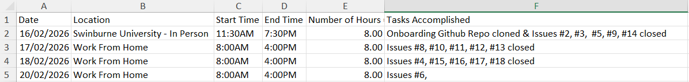

# Internship Time Plan — Piyush Arora

---

## Weekly Commitment Overview

I am committed to maintaining a consistent presence and completing my required hours through a mix of intensive blocks and scheduled weekly sessions.

| Period | Dates | Hours |
|---|---|---|
| Week 1 | 16/02/2026 – 22/02/2026 | 32 hours |
| Week 2 | 23/02/2026 – 01/03/2026 | 28 hours |
| Weeks 3–14 | 02/03/2026 – 29/05/2026 | 5–6 hours per week |

> **Note:** I will adjust additional hours as needed to meet project milestones and ensure timely delivery of tasks.

---

## Evidence & Tracking

I maintain a detailed spreadsheet recording dates, locations, hours worked, and specific tasks accomplished for full transparency and accountability.

